<p align="center">
  
  
</p>

# Description

  ## Table of Contents  
  * [Preliminary work before the course](#homework)  
  * [The course](#course)     
    * [Turtlesim](#turtlesim)
      * [Console controller](#Console)
      * [rqt control](#rqt)
      * [Terminal control](#Terminal)
    * [Create a Workspace](#workspace)
    * [Publisher - Subscriber](#pub)  
      * [Create interface](#TopicInterface)
      * [Create topic](#Topic)
      * [Create advanced topic](#TopicAd)
      * [Publish topic from terminal](#TopicTerminal)
    * [Service Server - Service Client](#SerCli)
      * [Create interface](#ServiceInterface)
      * [Create service](#Service)
      * [Call service from terminal](#ServiceTerminal)
    * [Action Server - Action Client](#Action)
      * [Create interface](#ActionInterface)
      * [Create action](#ActionSerCli)
      * [Send goal topic from terminal](#ActionTerminal)
  
<a name="homework"/>

# Preliminary work before the course
Before the course it would be preferable to perform the following steps:
  * [Installl WLS](#wls)
  * [Install Docker Desktop](#dockerDesktop)
  * [Download of ros-course image](#image)
  * [Instantiate the image](#instImage)

  <a name="wls"/>
  
  ## Install WSL

  Open PowerShell with administrator privileges and run the command:
  ```bash
  wsl --intall
  ```
  Restart your computer to finish the WSL installation on Windows.

  Always using PowerShell as administrator update the wsl
  ```bash
  wsl --update
  ```
  install the Debian distribution
  ```bash
  wsl --install -d Debian
  ```
  and move the distribution to distro 2
  ```bash
  wsl --set-version Debian 2
  ```
  To check to the successful installation type the following command to verify the version of the distro:
  ```bash
  wsl -l -v
  ```
  Confirm that the distribution is Debian with distro version 2.
  
  <a name="dockerDesktop"/>
  
  ## Installazione Docker Desktop
  Install Docker Desktop from the official Website :point_right:
  <a href="https://www.docker.com/products/docker-desktop/">
  
  </a>

  :warning: **Remember to run Docker Desktop as Amministrator every time** :warning:

  <a name="image"/>
  
  ## Download of ros-course image
  Launch the PowerShell as administrator and execute the following command to pull the image from the Docker Hub
  ```bash
  docker pull manuelalosupsi/ros-course
  ```
  
  <p align="center">
  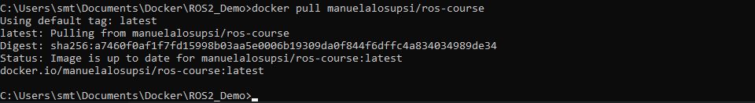
  </p>
  If the operation was successful you can find the <b>manuelalosupsi/ros-course</b> under <em>Image</em> tab of the Docker Desktop
  <p align="center">
  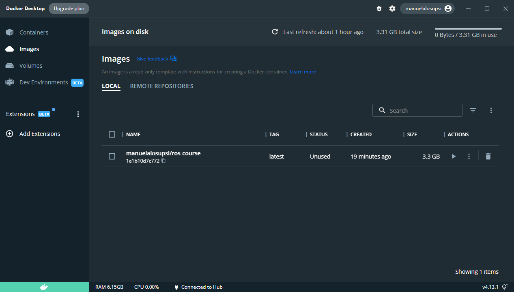
  </p>
  
  <a name="instImage"/>
  
  ## Instantiate the image
  To instantiate the image click on the play/run button :arrow_forward: (Actions column) under <em>Image</em> tab of the Docker Desktop
  <p align="center">
  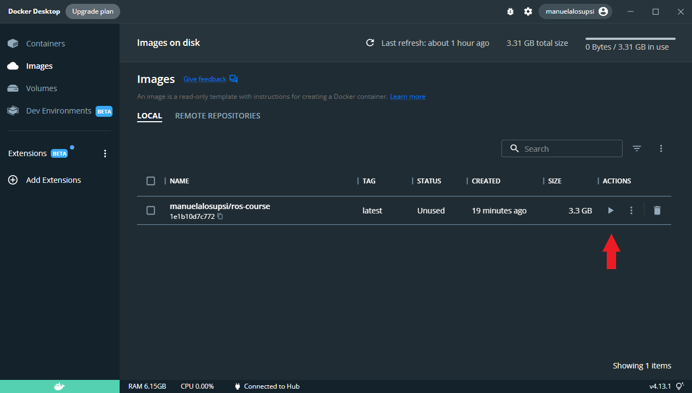
  </p>
  The <b> Run a new container</b> windows appears. Expand the <b>Optional settings</b> menu and compile it as follows:
  
  * <b>Container name</b>: RosCourse
  * <b>Host port</b>: 8080 

  and the press run
  <p align="center">
  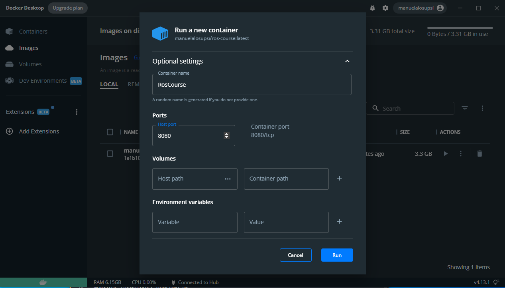
  </p>
  
  Now the image has been instantiate in a container and is in execution :horse_racing:
  <p align="center">
  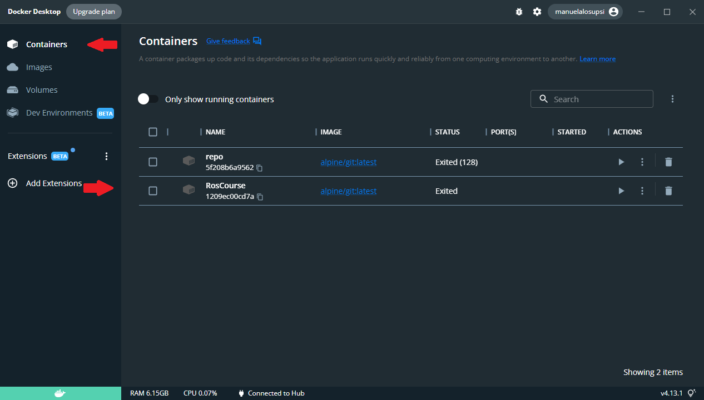
  </p>
 
  If it doesn't work? :tired_face: You can try to pull again the image and instantiate it by using the following command:
  ```bash
  docker run -it --rm -p 8080:8080 manuelalosupsi/ros-course
  ```
  
  ### noVNC to visualize the container
  To visualize the container in execution the noVNC tool can be used, which can be accessed via the following link 
  http://localhost:8080/vnc.html
  <p align="center">
  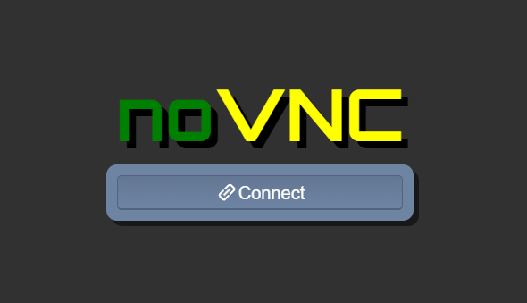
  </p>
  
  <div align="center"><h3>:muscle::muscle:Now you are ready for the course:muscle::muscle:</h3></div>
  
<a name="course"/>

# The Course
  
  There are two goals of this course.
  First, you will learn the basis of ROS2 in python using pre-existent pakages. At the end of this first part, you will be able to access Turtlesim and rqt,as  well as write some simple command lines to interact with turtles.
  
  <p align="center">
  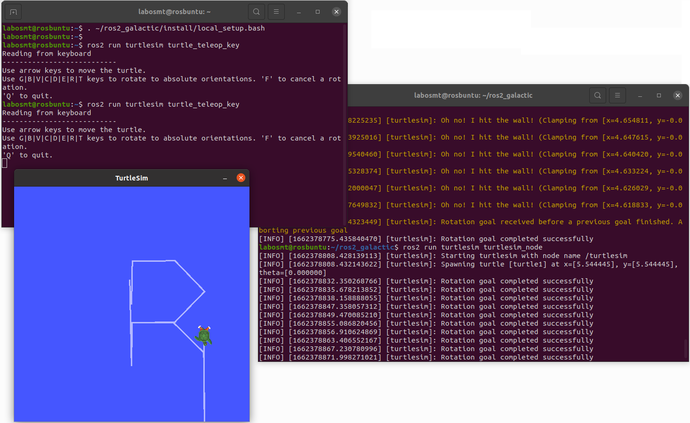
  </p>
  
  The second part will gide yout to the creation of a workspace from scratch, complete with interfaces and nodes. The aim of this second part is to create a step-by-step system in wcich a series of values are intrduces to be summed up, obtaining an indication of the status of the computation and the final result.
  At the end of the exercice, you will be able to create a workspace, an interface package, a simple topic node, a simple service node and a simple action node.
  
  <p align="center">
  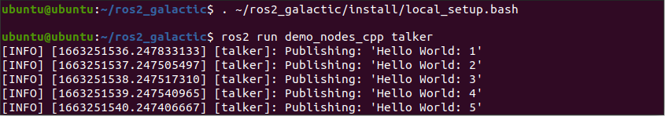
  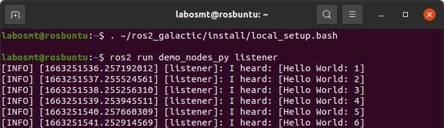
  </p>
  
  
  <a name="turtlesim"/>
  
  ## Turtlesim
  
  Turtlesim and rqt have been already installed the provided Docker.
  
  To launch turtlesim, opend a new terminal and type:
  
  ```bash
  ros2 run turtlesim turtlesim_node
  ```
  
  If the operation was successful, you will see a new window appear, as shown in the following figure.
  
  <p align="center">
  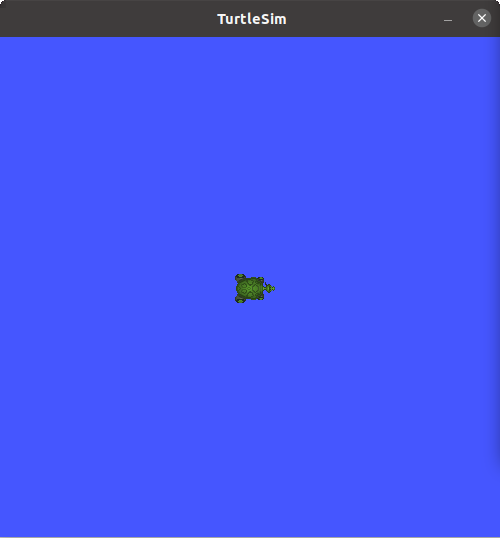
  </p>
  
  With the window alone, however, very little can be done. In order to move the turtle, you have to give it directions via specific commands.
Below are three different methods for doing this.

  <a name="Console"/>
  
  ### Console controller
  
  One of the simplest methods of controlling the turtle is through a controller.
  
  In a new terminal, type:
  
  ```bash
  ros2 run turtlesim turtle_teleop_key
  ```
  
   If the operation was successful, the terminal will resemble to the following image:
   
  <p align="center">
  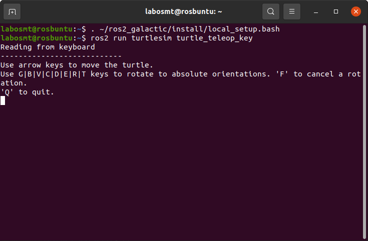
  </p>
  
  At this point you will be able to move the turtle around usind specific keys of the keyboard.
  
  <p align="center">
  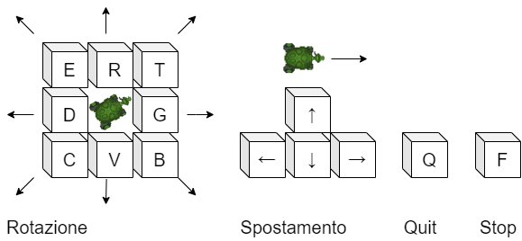
  </p>
  
  To stop this terminal press "Q".
  
  <a name="rqt"/>
  
  ### rqt control
  
  Another method is to use the rqt control panel.

  To open rqt, type in a new terminal:
  
  ```bash
  rqt
  ```

  The first time you open the window, it will be empty. To access the turtlesim control select:

  Plugins > Services > Service Caller

  To access the turtlesim control do not forget to refresh six services.
  
  <p align="center">
  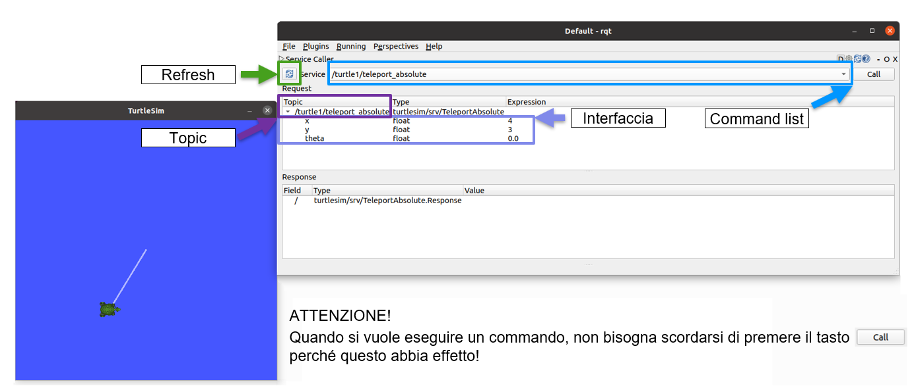
  </p>
  
   Look in the list of services for '/Spawn' and select it (light blue box).
   Then go to the interface box (violet) and enter the position of the new turtle by choosing x and y co-ordinates. If desired, you can specify the turtle's initial rotation angle and also its name. If no name is entered, the new turtle will automatically take the name 'turtle2'.

   Once you have completed the necessary fields, press the 'Call' button to call the service, i.e. send the creation request.
  
  <p align="center">
  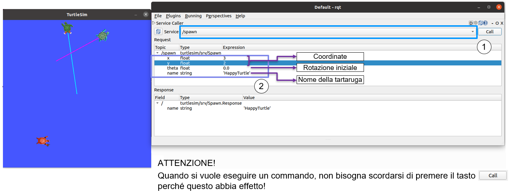
  </p>
  
  There will now be two turtlesim on the turtlesim terminal. In the example in the following figure the values entered are:
  
  ```bash  
  x       : 3
  y       : 2
  theta   : 0.0
  name    : 'HappyTurtle'
  ```
  
  <p align="center">
  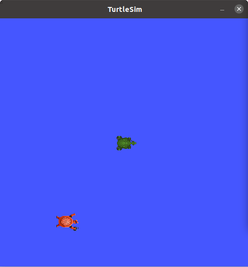
  </p>
  
  ATTENTION! If the appearance co-ordinates are the same, the turtles will overlap and it will only be possible to distinguish one of them.

  If you do a second refresh, you will see the topics of the second turtle appear.

  You can explore some of the functionality such as the commands:

  ```bash  
  /turtle1/set_pen
  /turtle1/teleport_absolute
  /turtle1/teleport_relative
  ```
  
  You can also send other types of commands, for example message type, by going to:

  Plugins > Topics > Message Publisher

  This allows you to see the list of topic commands. To send a command via the topic, select the desired topic from the list, select the frequency at which these messages will be sent (and thus executed). When the topic has been selected, add them by pressing the '+' button in the top right-hand corner. Now press the checklist to activate the command in loop mode and add the desired parameters.

  One of the topic message that can be written to the turtle is:
  
  ```bash  
  /turtle1/cmd_vel
  ```
  
  <p align="center">
  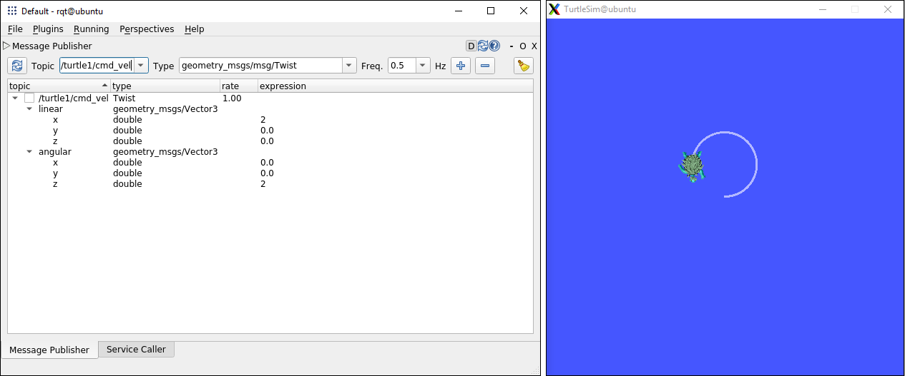
  </p>

  <a name="Terminal"/>
  
  ## Terminal control
  
  The last method is to publish the commands directley in the terminal.
  
  To see the list of possible command (topic type) type the following line in a new terminal:
  
  ```bash  
  ros2 topic list -t
  ```
  
  The optional parameter '-t' allows to see the interface name of the message. This is useful to know the structure of the message to publish.
  
  This line code should return this sequence:
  
  ```bash  
  /parameter_events [rcl_interfaces/msg/ParameterEvent] 
  /rosout [rcl_interfaces/msg/Log]
  /turtle1/cmd_vel [geometry_msgs/msg/Twist]
  /turtle1/color_sensor [turtlesim/msg/Color]
  /turtle1/pose [turtlesim/msg/Pose]
  ```
  
  You can try to move the turtle with the /turtle1/cmd_vel command, but how to write the message? And what struture should you use?
  
  To know the interface structure type:
  
  ```bash  
  ros2 interface show geometry_msgs/msg/Twist
  ```
  
  Which will return:
  
  ```bash  
  #This expresses velocity in free space broken into its linear and angular parts.

  Vector3  linear
             float64 x
             float64 y
             float64 z
  Vector3  angular
             float64 x
             float64 y
             float64 z
  ```

  To publish the topic /turtle1/cml_vel message to move the turtle in circle then, you can type:
  
  ```bash  
  ros2 topic pub /turtle1/cmd_vel geometry_msgs/msg/Twist "{linear: {x: 2.0, y: 0.0, z: 0.0}, angular: {x: 0.0, y: 0.0, z: 1.8}}" 
  ```
  
  To stop it press "Ctrl+C"
  
  TODO!!!!!!!!!!!!!
  <p align="center">
  
  </p>
  
  To move the turtle just once, add '--once' to the command in terminal:
  
  ```bash  
  ros2 topic pub /turtle1/cmd_vel geometry_msgs/msg/Twist "{linear: {x: 2.0, y: 0.0, z: 0.0}, angular: {x: 0.0, y: 0.0, z: 1.8}}" --once
  ```
  
  There is another type of message you can sent: the service type. At the moment let's just ignore what a servie message or a topic message are. This will be explaned later.
  To see the list of possible command (service type) type the following line in a new terminal:
  
  ```bash  
  ros2 service list -t
  ```
  
  The optional parameter '-t' allows to see the interface name of the message. This is useful to know the structure of the message to publish.
  
  This line code should return this sequence and more:
  
  ```bash  
  /clear [std_srvs/srv/Empty]
  /kill [turtlesim/srv/Kill]
  /reset [std_srvs/srv/Empty]
  /spawn [turtlesim/srv/Spawn]
  ```
  
  Let's focus on the /spawn command, to add a fresh new turtle to the terminal.
  
  To know the interface structure type:
  
  ```bash  
  ros2 interface show turtlesim/srv/Spawn
  ```
  
  Which will return:
  
  ```bash  
  float32 x
  float32 y
  float32 theta
  string name # Optional.  A unique name will be created and returned if this is empty
  ---
  string name
  ```

  To call the service /spawn to spawn a new turtle, you can type:
  
  ```bash  
  ros2 service call /spawn turtlesim/srv/Spawn '{x: 3, y: 2, theta: 0.0, name: "HappyTurtle"}'
  ```
  TODO!!!!!!!!!!!!!
  <p align="center">
  
  </p>
  
  
  Finally, the last message type is called 'action'. As the last command, let's just focus on how to use it.
  
  To see the action list type:
  
  ```bash  
  ros2 action list -t
  ```
  
  Let'send a goal to the action /turtle1/rotate_absolute, which will rotate the turtle 'turtle1' upon itself.
  
  ```bash  
  ros2 action send_goal /turtle1/rotate_absolute turtlesim/action/RotateAbsolute '{theta: -1.57}' --feedback
  ```
  
  --feedback is an optional parameter to display feedback during execution
  
  TODO!!!!!!!!!!!!!
  <p align="center">
  
  </p>

  <a name="workspace"/>
  
  ## Create a Workspace
  
  Now that you know the basis of ROS2, you are ready to create your first workspace, wich will contain all your ROS2 packages.
  
  To create the workspace type the following lines in a new terminal:
  
  ```bash  
  mkdir -p ~/ros2_ws/src
  cd ~/ros2_ws
  ```
  Compile it with the following command:
  
  ```bash  
  colcon build --symlink-install
  ```
  
  This will create the files used from the workspace.
  
  ```bash  
  ros2_ws
    ├── build
    ├── install
    ├── log
    └── src
  ```
  To test if everything was successful type:
  
  ```bash  
  colcon test
  ```
  
  Now your workspace is ready to be used. <b>Don't forget to source it in every new terminal!</b>
  
  ```bash  
  . install/setup.bash
  ```
  This line code has to be runned in the root of your workspace.

  <a name="pub"/>
  
  ## Publisher - Subscriber
  
  We want now to create one simple code that can display or treate received values.
  Let's create a system called 'publisher-subscriber'.
  The publisher will send some numbers and the subscriber will read and display them on its terminal.
  
  <a name="TopicInterface"/>
  
  ### Create interface
  
  First you will need a interface which define the message structure.
  
  It's then time to create a fresh new interface package to work with.
  
  Open a new terminal, <b> source the workspace!</b> and type:
  
  ```bash 
  cd src
  ros2 pkg create --build-type ament_cmake topic_message
  ```
  
  Your interface name is then 'topic_message'.
  
  This command will create a directory as shown here:
  
  ```bash
  topic_message
    ├── include
    ├── src
    ├── CMakeLists.txt
    └── package.xml
  ```
  Enter in the package and create a new directory 'msg':
  
  ```bash 
  cd topic_message
  mkdir msg
  ``` 
  
  Enter in the 'msg' directory and create a file named 'Numero.msg'. This will contain your structure.
  
  ```bash 
  cd msg
  cat > 'Numero.msg'
  int64 a
  
  # Press Ctrl+D to save and close
  # Or press Ctrl+S to save
  # and then Cltr+X to exit the file
  ``` 
  Your package will now have those directory:
  
  ```bash
  topic_message
    ├── include
    ├── src
    ├── msg
    ├── CMakeLists.txt
    └── package.xml
  ```
  
  You are almost done!
  
  You have to modify the file CMackeLists.txt to add the required dependencies.
  Add the following lines in the CMackeLists.txt file:
  
  ```bash
  find_package(rosidl_default_generators REQUIRED)
  
  rosidl_generate_interfaces(${PROJECT_NAME}
    "msg/Numero.msg"
  )
  ```
  Your CMakeLists.txt file should resamble to this:
  
  ```bash
  cmake_minimum_required(VERSION 3.8)
  project(topic_message)

  if(CMAKE_COMPILER_IS_GNUCXX OR CMAKE_CXX_COMPILER_ID MATCHES "Clang")
    add_compile_options(-Wall -Wextra -Wpedantic)
  endif()

  # find dependencies
  find_package(ament_cmake REQUIRED)
  # uncomment the following section in order to fill in
  # further dependencies manually.
  # find_package(<dependency> REQUIRED)

  # START ADDED LINES
  find_package(rosidl_default_generators REQUIRED)

  rosidl_generate_interfaces(${PROJECT_NAME}
    "msg/Numero.msg"
  )
  # END ADDED LINES
  
  if(BUILD_TESTING)
    find_package(ament_lint_auto REQUIRED)
    # the following line skips the linter which checks for copyrights
    # uncomment the line when a copyright and license is not present in all source files
    #set(ament_cmake_copyright_FOUND TRUE)
    # the following line skips cpplint (only works in a git repo)
    # uncomment the line when this package is not in a git repo
    #set(ament_cmake_cpplint_FOUND TRUE)
    ament_lint_auto_find_test_dependencies()
  endif()

  ament_package()
  ```
  Now you need to modify the package.xml file.
  
  Add those lines in the package.xml file:
  
  ```bash
  <build_depend>rosidl_default_generators</build_depend>
  
  <exec_depend>rosidl_default_runtime</exec_depend>
  
  <member_of_group>rosidl_interface_packages</member_of_group>
  ```
  
  Your packages.xml file should resamble to this:
  
  ```bash
  <?xml version="1.0"?>
  <?xml-model href="http://download.ros.org/schema/package_format3.xsd" schematypens="http://www.w3.org/2001/XMLSchema"?>
  <package format="3">
    <name>topic_message</name>
    <version>0.0.0</version>
    <description>TODO: Package description</description>
    <maintainer email="labosmt@todo.todo">labosmt</maintainer>
    <license>TODO: License declaration</license>

    <buildtool_depend>ament_cmake</buildtool_depend>

    <test_depend>ament_lint_auto</test_depend>
    <test_depend>ament_lint_common</test_depend>

    <export>
      <build_type>ament_cmake</build_type>
    </export>

    # START ADDED LINES
    <build_depend>rosidl_default_generators</build_depend>
    
    <exec_depend>rosidl_default_runtime</exec_depend>

    <member_of_group>rosidl_interface_packages</member_of_group>
    # END ADDED LINES
  </package>
  ```
  The interface is ready to be compiled and used!
  
  To compile the package in the root of the workspace and type:
  
  ```bash
  colcon build --packages-select topic_message
  ```
  To access the new interface, don't forget to source the workspace!
  
  ```bash  
  . install/setup.bash
  ```
  
  To verify that the interface creation was successful type:
  
  ```bash  
  ros2 interface show topic_message/msg/Numero
  ```
  
  Should return this message:
  
  ```bash  
  int64 numero
  ```
  
  <a name="Topic"/>
  
  ### Create topic
  
  As before, you can now create your topic package.
  
  Open a new terminal and type from the root of your workspace:
  
  ```bash
  cd src
  
  ros2 pkg create --build-type ament_python my_topic --dependencies topic_message rclpy
  ```
  Go in the new package my_topic. It should have this strucure:
 
  ```bash
  my_topic
    ├── package.xml
    ├── setup.cfg
    ├── my_topic
    |         └── __init__.py
    ├── resource
    |         └── 
    └── test
         ├── test_copyright.py
         ├── test_flake8.py
         └── test_pep257.py
  ```
  Go in my_topic/my_topic directory and create two new files publisher.py and subscriber.py:
  
  ```bash
  cd my_topic/my_topic
  
  cat > 'publisher.py' # Press Ctrl+D
  cat > 'subscriber.py' # Press Ctrl+D
  ```
  
  In the publisher.py write:
  
  ```bash
  import rclpy
  from rclpy.node import Node

  from topic_message.msg import Numero


  class MinimalPublisher(Node):

      def __init__(self):
          super().__init__('minimal_publisher')
          self.publisher_ = self.create_publisher(Numero, 'topic', 10)
          timer_period = 0.5  # seconds
          self.timer = self.create_timer(timer_period, self.timer_callback)

      def timer_callback(self):
          msg = Numero()
          msg.a = 0 
          self.publisher_.publish(msg)
          self.get_logger().info('Publishing: "%d"' % msg.a)


  def main(args=None):
      rclpy.init(args=args)

      minimal_publisher = MinimalPublisher()

      rclpy.spin(minimal_publisher)

      # Destroy the node explicitly
      # (optional - otherwise it will be done automatically
      # when the garbage collector destroys the node object)
      minimal_publisher.destroy_node()
      rclpy.shutdown()


  if __name__ == '__main__':
      main()
  ```
  
  In the subscriber.py write:
  
  ```bash
  import rclpy
  from rclpy.node import Node

  from topic_message.msg import Numero


  class MinimalSubscriber(Node):

      def __init__(self):
          super().__init__('minimal_subscriber')
          self.subscription = self.create_subscription(
              Numero,
              'topic',
              self.listener_callback,
              10)
          self.subscription  # prevent unused variable warning

      def listener_callback(self, msg):
          self.get_logger().info('I heard: "%d"' % msg.a)


  def main(args=None):
      rclpy.init(args=args)

      minimal_subscriber = MinimalSubscriber()

      rclpy.spin(minimal_subscriber)

      # Destroy the node explicitly
      # (optional - otherwise it will be done automatically
      # when the garbage collector destroys the node object)
      minimal_subscriber.destroy_node()
      rclpy.shutdown()


  if __name__ == '__main__':
      main()
  ```
  
  Modify the file setup.py and add the followings lines:
  
  ```bash
  entry_points={
      'console_scripts': [
          'talker=my_topic.publisher:main',
          'listener=my_topic.subscriber:main',
      ],
  },
  ```
  
  The final setup.py file should resamble to:
  
  ```bash
  from setuptools import setup

  package_name = 'my_topic'

  setup(
      name=package_name,
      version='0.0.0',
      packages=[package_name],
      data_files=[
          ('share/ament_index/resource_index/packages',
              ['resource/' + package_name]),
          ('share/' + package_name, ['package.xml']),
      ],
      install_requires=['setuptools'],
      zip_safe=True,
      maintainer='labosmt',
      maintainer_email='labosmt@todo.todo',
      description='TODO: Package description',
      license='TODO: License declaration',
      tests_require=['pytest'],
      entry_points={
          'console_scripts': [
              'talker=my_topic.publisher:main',
              'listener=my_topic.subscriber:main',
          ],
      },
  )
  ```   
  
  Now return in the root of the workspace and build the new package:
  
  ```bash
  cd ../.. # Return in workspace root
  
  colcon build --packages-select my_topic
  ```
  
  To access the new package, don't forget to source the workspace!
  
  ```bash  
  . install/setup.bash
  ```
  
  Now open a new terminal and run your topic subscriber:

  ```bash
  . install/setup.bash
  ros2 run my_topic listener
  ```
  
  Now open a new terminal and run your topic publisher:

  ```bash  
  . install/setup.bash
  ros2 run my_topic talker
  ```
  
  TODO!!!!!!!!!!!!!
  <p align="center">
  
  </p>
  
  <a name="TopicAd"/>
  
  ### Create advanced topic
  
  Now you can try to create from strach a new topic and a new interface.
  
  Create an interface named 'topic_messages' with this structure:
  
  ```bash  
  int64 a
  int64 b
  ```
  
  Create a new topic named 'my_advanced_topic' that use the interface 'topic_messages' which publish two numbers.
  
  <a name="TopicTerminal"/>
  
  ## Publish topic from terminal
  
  If you want, you can publish a topic from terminal.
  
  Open a new terminal and run your topic subscriber:

  ```bash
  . install/setup.bash
  ros2 run my_topic listener
  ```
  
  With the acquired knowledge, try to publish a topic using this command line as suggestion:
  
  ```bash  
  ros2 topic pub <topic_name> <msg_type> '<arguments>' --once 
  ```
  
  Hint:
  Use the following commands to get informations of the structure of the message to publish:
  
  ```bash
  ros2 topic list -t
  ```
  
  ```bash
  ros2 interface show <interface_name>  
  ```
      
  Hint:
  Please notice that the topic name always contains '/' at firt.
  Please notice that the interface name don't contains '/' at firt, but need the whole directory.
   
  Hint:
  If something goes wrong, check the spaces in the command arguments.
  The argument need this form to work properly:
  
  '{<variable_name>: <varialbe_value>, <variable_name>: <varialbe_value>}'
  
  <b>Don't forget to source your publish terminal before start!</b>
  
  TODO!!!!!!!!!!!!!
  <p align="center">
  
  </p>
      
  <a name="SerCli"/>
  
  ## Service Server - Service Client
  
  We created a publisher subscriber that show one or more values transmitted. Now we want to add a little step and create a simple code that can execute some task by itself. In this case we want to send the request to sum two numbers and get the result went the computation is done.
  Let's create a system called 'Service'.
  The service client will send some numbers and the service server will send back the sum.
  
  <a name="ServiceInterface"/>
  
  ## Create interface
  
  First you will need a interface which define the message structure.
  
  It's then time to create a fresh new interface package to work with.
  
  Open a new terminal, <b> source the workspace!</b> and type:
  
  ```bash 
  cd src
  ros2 pkg create --build-type ament_cmake service_message
  ```
  
  Your interface name is then 'service_message'.
  
  This command will create a directory as shown here:
  
  ```bash
  service_message
    ├── include
    ├── src
    ├── CMakeLists.txt
    └── package.xml
  ```
  Enter in the package and create a new directory 'srv':
  
  ```bash 
  cd service_message
  mkdir srv
  ``` 
  
  Enter in the 'srv' directory and create a file named 'Somma.srv'. This will contain your structure.
  
  ```bash 
  cd srv
  cat > 'Somma.srv'
  int64 a
  int64 b
  ---
  int64 somma
  
  # Press Ctrl+D to save and close
  # Or press Ctrl+S to save
  # and then Cltr+X to exit the file
  ``` 
  Your package will now have those directory:
  
  ```bash
  service_message
    ├── include
    ├── src
    ├── srv
    ├── CMakeLists.txt
    └── package.xml
  ```
  
  You are almost done!
  
  You have to modify the file CMackeLists.txt to add the required dependencies.
  Add the following lines in the CMackeLists.txt file:
  
  ```bash
  find_package(rosidl_default_generators REQUIRED)
  
  rosidl_generate_interfaces(${PROJECT_NAME}
    "srv/Somma.srv"
  )
  ```
  Your CMakeLists.txt file should resamble to this:
  
  ```bash
  cmake_minimum_required(VERSION 3.8)
  project(service_message)

  if(CMAKE_COMPILER_IS_GNUCXX OR CMAKE_CXX_COMPILER_ID MATCHES "Clang")
    add_compile_options(-Wall -Wextra -Wpedantic)
  endif()

  # find dependencies
  find_package(ament_cmake REQUIRED)
  # uncomment the following section in order to fill in
  # further dependencies manually.
  # find_package(<dependency> REQUIRED)

  find_package(rosidl_default_generators REQUIRED)

  rosidl_generate_interfaces(${PROJECT_NAME}
    "srv/Somma.srv"
  )

  if(BUILD_TESTING)
    find_package(ament_lint_auto REQUIRED)
    # the following line skips the linter which checks for copyrights
    # uncomment the line when a copyright and license is not present in all source files
    #set(ament_cmake_copyright_FOUND TRUE)
    # the following line skips cpplint (only works in a git repo)
    # uncomment the line when this package is not in a git repo
    #set(ament_cmake_cpplint_FOUND TRUE)
    ament_lint_auto_find_test_dependencies()
  endif()

  ament_package()
  ```
  Now you need to modify the package.xml file.
  
  Add those lines in the package.xml file:
  
  ```bash
  <build_depend>rosidl_default_generators</build_depend>
  
  <exec_depend>rosidl_default_runtime</exec_depend>
  
  <member_of_group>rosidl_interface_packages</member_of_group>
  ```
  
  Your packages.xml file should resamble to this:
  
  ```bash
  <?xml version="1.0"?>
  <?xml-model href="http://download.ros.org/schema/package_format3.xsd" schematypens="http://www.w3.org/2001/XMLSchema"?>
  <package format="3">
    <name>service_message</name>
    <version>0.0.0</version>
    <description>TODO: Package description</description>
    <maintainer email="labosmt@todo.todo">labosmt</maintainer>
    <license>TODO: License declaration</license>

    <buildtool_depend>ament_cmake</buildtool_depend>

    <test_depend>ament_lint_auto</test_depend>
    <test_depend>ament_lint_common</test_depend>

    <export>
      <build_type>ament_cmake</build_type>
    </export>

    <build_depend>rosidl_default_generators</build_depend>

    <exec_depend>rosidl_default_runtime</exec_depend>

    <member_of_group>rosidl_interface_packages</member_of_group>
  </package>
  ```
  The interface is ready to be compiled and used!
  
  To compile the package in the root of the workspace and type:
  
  ```bash
  colcon build --packages-select service_message
  ```
  To access the new interface, don't forget to source the workspace!
  
  ```bash  
  . install/setup.bash
  ```
  
  To verify that the interface creation was successful type:
  
  ```bash  
  ros2 interface show service_message/srv/Somma
  ```
  
  Should return this message:
  
  ```bash  
  int64 a
  int64 b
  ---
  int64 somma
  ```
  
  <a name="Service"/>
  
  ## Create service
  
  As before, you can now create your service package.
  
  Open a new terminal and type from the root of your workspace:
  
  ```bash
  cd src
  
  ros2 pkg create --build-type ament_python my_service --dependencies service_message rclpy
  ```
  Go in the new package my_service. It should have this strucure:
 
  ```bash
  my_service
    ├── package.xml
    ├── setup.cfg
    ├── my_service
    |         └── __init__.py
    ├── resource
    |         └── 
    └── test
         ├── test_copyright.py
         ├── test_flake8.py
         └── test_pep257.py
  ```
  Go in my_service/my_service directory and create two new files service_client.py and service_server.py:
  
  ```bash
  cd my_service/my_service
  
  cat > 'service_client.py' # Press Ctrl+D
  cat > 'service_server.py' # Press Ctrl+D
  ```
  
  In the service_client.py write:
  
  ```bash
  from service_message.srv import Somma

  import rclpy
  from rclpy.node import Node


  class MinimalClientAsync(Node):

      def __init__(self):
          super().__init__('minimal_client_async')
          self.cli = self.create_client(Somma, 'sum_values')

          while not self.cli.wait_for_service(timeout_sec=1.0):
              self.get_logger().info('service not available, waiting again...')
          self.req = Somma.Request()

      def send_request(self):
          self.req.a = 1
          self.req.b = 2
          self.future = self.cli.call_async(self.req)


  def main(args=None):
      rclpy.init(args=args)

      minimal_client = MinimalClientAsync()
      minimal_client.send_request()

      while rclpy.ok():
          rclpy.spin_once(minimal_client)
          if minimal_client.future.done():
              try:
                  response = minimal_client.future.result()
              except Exception as e:
                  minimal_client.get_logger().info(
                      'Service call failed %r' % (e,))
              else:
                  minimal_client.get_logger().info(
                      'Result sum: %d + %d = %d' % (minimal_client.req.a, minimal_client.req.b, response.somma))
              break

      minimal_client.destroy_node()
      rclpy.shutdown()


  if __name__ == '__main__':
      try:
          main()

      except KeyboardInterrupt:          # trap a CTRL+C keyboard interrupt  
          self.get_logger().info('Program has stop...')
  ```
  
  In the service_server.py write:
  
  ```bash
  from service_message.srv import Somma

  import rclpy
  from rclpy.node import Node


  class MinimalService(Node):

      def __init__(self):
          super().__init__('minimal_service')
          self.srv = self.create_service(Somma, 'sum_values', self.sum_values_callback)

      def sum_values_callback(self, request, response):
          response.somma = request.a + request.b

          self.get_logger().info('Incoming request\na: %d b: %d' % (request.a, request.b))

          return response

  def main(args=None):
      rclpy.init(args=args)

      minimal_service = MinimalService()

      rclpy.spin(minimal_service)

      rclpy.shutdown()

  if __name__ == '__main__':
      main()
  ```

  Modify the file setup.py and add the followings lines:

  ```bash
  entry_points={
      'console_scripts': [
        'service = my_service.service_server:main',
        'client = my_service.service_client:main',
      ],
    },
  ```
  
  The final setup.py file should resamble to:
  
  ```bash
  from setuptools import setup

  package_name = 'my_service'

  setup(
      name=package_name,
      version='0.0.0',
      packages=[package_name],
      data_files=[
          ('share/ament_index/resource_index/packages',
              ['resource/' + package_name]),
          ('share/' + package_name, ['package.xml']),
      ],
      install_requires=['setuptools'],
      zip_safe=True,
      maintainer='labosmt',
      maintainer_email='labosmt@todo.todo',
      description='TODO: Package description',
      license='TODO: License declaration',
      tests_require=['pytest'],
      entry_points={
          'console_scripts': [
            'service = my_service.service_server:main',
            'client = my_service.service_client:main',
          ],
      },
  )
  ```   
  
  Now return in the root of the workspace and build the new package:
  
  ```bash
  cd ../.. # Return in workspace root
  
  colcon build --packages-select my_service
  ```
  
  To access the new package, don't forget to source the workspace!
  
  ```bash  
  . install/setup.bash
  ```
  
  Now open a new terminal and run your service client:

  ```bash  
  . install/setup.bash
  ros2 run my_service client
  ```
  
  Now open a new terminal and run your service server:

  ```bash  
  . install/setup.bash
  ros2 run my_service service
  ```
  
  TODO!!!!!!!!!!!!!
  <p align="center">
  
  </p>
  
  <a name="ServiceTerminal"/>
  
  ## Call service from terminal
  
  If you want, you can call a service from terminal.
  
  Open a new terminal and run your service server:

  ```bash
  . install/setup.bash
  ros2 run my_service service
  ```
  
  With the acquired knowledge, try to call a service using this command line as suggestion:
  
  ```bash  
  ros2 service call <service_name> <srv_type> '<arguments>'
  ```
  
  Hint:
  Use the following commands to get informations of the structure of the service to call:
  
  ```bash
  ros2 service list -t
  ```
  
  ```bash
  ros2 interface show <interface_name>  
  ```
      
  Hint:
  Please notice that the service name always contains '/' at firt.
  Please notice that the interface name don't contains '/' at firt, but need the whole directory.
   
  Hint:
  If something goes wrong, check the spaces in the command arguments.
  The argument need this form to work properly:
  
  '{<variable_name>: <varialbe_value>, <variable_name>: <varialbe_value>}'
  
  <b>Don't forget to source your publish terminal before start!</b>
  
  TODO!!!!!!!!!!!!!
  <p align="center">
  
  </p>
  
  <a name="Action"/>
  
  ## Action Server - Action Client
  
  We created a publisher subscriber and a service server/client. Now we want to add a final step and create a simple code that can execute some task by itself and send some feedbacks while executing task. In this case we want to send the request to sum a number a certain numebr of time, while get some informations on execution and get the result went the computation is done. This task will act as a multiplication, but to show the computation's progress through the feedback, it use the sum to get result.
  Let's create a system called 'Action'.
  The action client will send some numbers and the action server will send back the sum.
  
  <a name="ActionInterface"/>
  
  ## Create action
  
  First you will need a interface which define the message structure.
  
  It's then time to create a fresh new interface package to work with.
  
  Open a new terminal, <b> source the workspace!</b> and type:
  
  ```bash 
  cd src
  ros2 pkg create --build-type ament_cmake action_message
  ```
  
  Your interface name is then 'action_message'.
  
  This command will create a directory as shown here:
  
  ```bash
  action_message
    ├── include
    ├── src
    ├── CMakeLists.txt
    └── package.xml
  ```
  Enter in the package and create a new directory 'action':
  
  ```bash 
  cd action_message
  mkdir action
  ``` 
  
  Enter in the 'action' directory and create a file named 'SommaFeed.action'. This will contain your structure.
  
  ```bash 
  cd action
  cat > 'SommaFeed.action'
  int64 a
  int64 ripetizioni
  ---
  int64 somma
  ---
  string msg
  
  # Press Ctrl+D to save and close
  # Or press Ctrl+S to save
  # and then Cltr+X to exit the file
  ``` 
  Your package will now have those directory:
  
  ```bash
  action_message
    ├── include
    ├── src
    ├── action
    ├── CMakeLists.txt
    └── package.xml
  ```
  
  You are almost done!
  
  You have to modify the file CMackeLists.txt to add the required dependencies.
  Add the following lines in the CMackeLists.txt file:
  
  ```bash
  find_package(rosidl_default_generators REQUIRED)
  
  rosidl_generate_interfaces(${PROJECT_NAME}
    "action/SommaFeed.action"
  )
  ```
  Your CMakeLists.txt file should resamble to this:
  
  ```bash
  cmake_minimum_required(VERSION 3.8)
  project(action_message)

  if(CMAKE_COMPILER_IS_GNUCXX OR CMAKE_CXX_COMPILER_ID MATCHES "Clang")
    add_compile_options(-Wall -Wextra -Wpedantic)
  endif()

  # find dependencies
  find_package(ament_cmake REQUIRED)
  # uncomment the following section in order to fill in
  # further dependencies manually.
  # find_package(<dependency> REQUIRED)

  find_package(rosidl_default_generators REQUIRED)

  rosidl_generate_interfaces(${PROJECT_NAME}
    "action/SommaFeed.action"
  )

  if(BUILD_TESTING)
    find_package(ament_lint_auto REQUIRED)
    # the following line skips the linter which checks for copyrights
    # uncomment the line when a copyright and license is not present in all source files
    #set(ament_cmake_copyright_FOUND TRUE)
    # the following line skips cpplint (only works in a git repo)
    # uncomment the line when this package is not in a git repo
    #set(ament_cmake_cpplint_FOUND TRUE)
    ament_lint_auto_find_test_dependencies()
  endif()

  ament_package()
  ```
  Now you need to modify the package.xml file.
  
  Add those lines in the package.xml file:
  
  ```bash
  <buildtool_depend>rosidl_default_generators</buildtool_depend>

  <depend>action_msgs</depend>

  <member_of_group>rosidl_interface_packages</member_of_group>
  ```
  
  Your packages.xml file should resamble to this:
  
  ```bash
  <?xml version="1.0"?>
  <?xml-model href="http://download.ros.org/schema/package_format3.xsd" schematypens="http://www.w3.org/2001/XMLSchema"?>
  <package format="3">
    <name>action_message</name>
    <version>0.0.0</version>
    <description>TODO: Package description</description>
    <maintainer email="labosmt@todo.todo">labosmt</maintainer>
    <license>TODO: License declaration</license>

    <buildtool_depend>ament_cmake</buildtool_depend>

    <test_depend>ament_lint_auto</test_depend>
    <test_depend>ament_lint_common</test_depend>

    <export>
      <build_type>ament_cmake</build_type>
    </export>

    <buildtool_depend>rosidl_default_generators</buildtool_depend>

    <depend>action_msgs</depend>

    <member_of_group>rosidl_interface_packages</member_of_group>
  </package>
  ```
  Please note that in this case you are using some code closely related to actions! You are not creating a simple interface as topic or service interface.
  
  The interface is ready to be compiled and used!
  
  To compile the package in the root of the workspace and type:
  
  ```bash
  colcon build --packages-select action_message
  ```
  To access the new interface, don't forget to source the workspace!
  
  ```bash  
  . install/setup.bash
  ```
  
  To verify that the interface creation was successful type:
  
  ```bash  
  ros2 interface show action_message/action/SommaFeed
  ```
  
  Should return this message:
  
  ```bash  
  int64 a
  int64 ripetizioni
  ---
  int64 somma
  ---
  string msg
  ```
  
  <a name="ActionSerCli"/>
  
  ## Create action
    
  As before, you can now create your action package.
  
  Open a new terminal and type from the root of your workspace:
  
  ```bash
  cd src
  
  ros2 pkg create --build-type ament_python my_action --dependencies action_message rclpy
  ```
  Go in the new package my_action. It should have this strucure:
 
  ```bash
  my_action
    ├── package.xml
    ├── setup.cfg
    ├── my_action
    |         └── __init__.py
    ├── resource
    |         └── 
    └── test
         ├── test_copyright.py
         ├── test_flake8.py
         └── test_pep257.py
  ```
  Go in my_action/my_action directory and create two new files action_client.py and action_server.py:
  
  ```bash
  cd my_action/my_action
  
  cat > 'action_client.py' # Press Ctrl+D
  cat > 'action_server.py' # Press Ctrl+D
  ```
  
  In the action_client.py write:
  
  ```bash
  import rclpy
  from rclpy.action import ActionClient
  from rclpy.node import Node

  from action_message.action import SommaFeed

  class SumActionClient(Node):

      def __init__(self):
          super().__init__('somma_action_server')
          self._action_client = ActionClient(self, SommaFeed, 'values_sum_feed')
          self.get_logger().info("Initialisation OK")

      def send_goal(self):
          self.get_logger().info("I'm going to send goal")

          goal_msg = SommaFeed.Goal()

          goal_msg.a = 1
          goal_msg.ripetizioni = 4

          self._action_client.wait_for_server()

          self._send_goal_future = self._action_client.send_goal_async(goal_msg, feedback_callback=self.feedback_callback)

          self._send_goal_future.add_done_callback(self.goal_response_callback)

      def goal_response_callback(self, future):
          goal_handle = future.result()
          if not goal_handle.accepted:
              self.get_logger().info('Goal rejected :(')
              return

          self.get_logger().info('Goal accepted :)')

          self._get_result_future = goal_handle.get_result_async()
          self._get_result_future.add_done_callback(self.get_result_callback)

      def get_result_callback(self, future):
          result = future.result().result
          self.get_logger().info('Result: {0}'.format(result.somma))
          rclpy.shutdown()

      def feedback_callback(self, feedback_msg):
          feedback = feedback_msg.feedback
          self.get_logger().info('Received feedback: {0}'.format(feedback.msg))


  def main(args=None):
      rclpy.init(args=args)

      action_client = SumActionClient()

      action_client.send_goal()

      rclpy.spin(action_client)


  if __name__ == '__main__':
      main()
  ```
  
  In the action_server.py write:
  
  ```bash
  import rclpy
  import time
  from rclpy.action import ActionServer
  from rclpy.node import Node

  from action_message.action import SommaFeed

  class SumActionServer(Node):

      def __init__(self):
          super().__init__('somma_action_server')
          self._action_server = ActionServer(
              self,
              SommaFeed,
              'values_sum_feed',
              self.execute_callback)

          self.interim_result = 0

      def execute_callback(self, goal_handle):
          self.get_logger().info('Executing goal...')

          feedback_msg = SommaFeed.Feedback()

          feedback_msg.msg = "I'm going to start sum..."

          self.interim_result = 0


          for i in range(1, goal_handle.request.ripetizioni + 1):

              self.interim_result += goal_handle.request.a

              feedback_msg.msg = "Iteration " + str(i) + ". Actual result = " + str(self.interim_result)

              self.get_logger().info('Feedback: {0}'.format(feedback_msg.msg))

              goal_handle.publish_feedback(feedback_msg)

              time.sleep(1)


          goal_handle.succeed()

          result = SommaFeed.Result()

          result.somma = self.interim_result

          return result

  def main(args=None):
      rclpy.init(args=args)

      action_server = SumActionServer()

      while rclpy.ok():
          rclpy.spin(action_server)

      minimal_service.destroy_node()
      rclpy.shutdown()

  if __name__ == '__main__':
      try:
          main()
      except KeyboardInterrupt():
          print("Finished...")
  ```

  Modify the file setup.py and add the followings lines:

  ```bash
  entry_points={
      'console_scripts': [
          'action_server = my_action.action_server:main',
          'action_client = my_action.action_client:main',
      ],
  },
  ```
  
  The final setup.py file should resamble to:
  
  ```bash
  from setuptools import setup

  package_name = 'my_action'

  setup(
      name=package_name,
      version='0.0.0',
      packages=[package_name],
      data_files=[
          ('share/ament_index/resource_index/packages',
              ['resource/' + package_name]),
          ('share/' + package_name, ['package.xml']),
      ],
      install_requires=['setuptools'],
      zip_safe=True,
      maintainer='labosmt',
      maintainer_email='labosmt@todo.todo',
      description='TODO: Package description',
      license='TODO: License declaration',
      tests_require=['pytest'],
      entry_points={
          'console_scripts': [
              'action_server = my_action.action_server:main',
              'action_client = my_action.action_client:main',
          ],
      },
  )
  ```   
  
  Now return in the root of the workspace and build the new package:
  
  ```bash
  cd ../.. # Return in workspace root
  
  colcon build --packages-select my_action
  ```
  
  To access the new package, don't forget to source the workspace!
  
  ```bash  
  . install/setup.bash
  ```
  
  Now open a new terminal and run your action client:

  ```bash  
  . install/setup.bash
  ros2 run my_action action_client
  ```
  
  Now open a new terminal and run your action server:

  ```bash  
  . install/setup.bash
  ros2 run my_action action_server
  ```
  
  TODO!!!!!!!!!!!!!
  <p align="center">
  
  </p>
  
  <a name="ActionTerminal"/>
  
  ## Send goal from terminal
  
  If you want, you can send an action goal from terminal.
  
  Open a new terminal and run your action server:

  ```bash
  . install/setup.bash
  ros2 run my_action action_server
  ```
  
  With the acquired knowledge, try to send an action goal using this command line as suggestion:
  
  ```bash  
  ros2 action send_goal <action_name> <action_type> '<arguments>'
  ```
  
  Hint:
  Use the following commands to get informations of the structure of the goal to send:
  
  ```bash
  ros2 action list -t
  ```
  
  ```bash
  ros2 interface show <interface_name>  
  ```
      
  Hint:
  Please notice that the action name always contains '/' at firt.
  Please notice that the interface name don't contains '/' at firt, but need the whole directory.
   
  Hint:
  If something goes wrong, check the spaces in the command arguments.
  The argument need this form to work properly:
  
  '{<variable_name>: <varialbe_value>, <variable_name>: <varialbe_value>}'
  
  <b>Don't forget to source your publish terminal before start!</b>
  
  TODO!!!!!!!!!!!!!
  <p align="center">
  
  </p>
