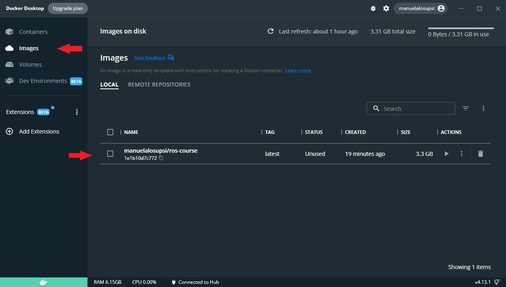
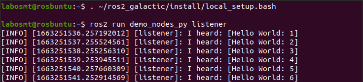

<p align="center">
  
  
</p>

# Description

  ## Table of Contents  
  * [Preliminary work before the course](#homework)  
  * [The course](#course)     
    * [Turtlesim](#turtlesim)
      * [Console controller](#Console)
      * [rqt control](#rqt)
      * [Terminal control](#Terminal)
    * [Create a Workspace](#workspace)
    * [Publisher - Subscriber](#pub)  
    * [Service Server - Service Client](#service)  
    * [Action Server - Action Client](#action)  

  
<a name="homework"/>

# Preliminary work before the course
Before the course it would be preferable to perform the following steps:
  * [Installl WLS](#wls)
  * [Install Docker Desktop](#dockerDesktop)
  * [Download of ros-course image](#image)
  * [Instantiate the image](#instImage)

  <a name="wls"/>
  
  ## Install WLS

  Open PowerShell with administrator privileges and run the command:
  ```bash
  wsl --intall
  ```
  Restart your computer to finish the WSL installation on Windows.

  Always using PowerShell as administrator update the wsl
  ```bash
  wsl --update
  ```
  install the Debian distribution
  ```bash
  wsl --install -d Debian
  ```
  and move the distribution to distro 2
  ```bash
  wsl --set-version Debian 2
  ```
  To check to the successful installation type the following command to verify the version of the distro:
  ```bash
  wsl -l -v
  ```
  Confirm that the distribution is Debian with distro version 2.
  
  <a name="dockerDesktop"/>
  
  ## Installazione Docker Desktop
  Install Docker Desktop from the official Website :point_right:
  <a href="https://www.docker.com/products/docker-desktop/">
  
  </a>

  :warning: **Remember to run Docker Desktop as Amministrator every time** :warning:

  <a name="image"/>
  
  ## Download of ros-course image
  Launch the PowerShell as administrator and execute the following command to pull the image from the Docker Hub
  ```bash
  docker pull manuelalosupsi/ros-course
  ```
  If the operation was successful you can find the <b>manuelalosupsi/ros-course</b> under <em>Image</em> tab of the Docker Desktop
  <p align="center">
  
  </p>
  
  <a name="instImage"/>
  
  ## Instantiate the image
  To instantiate the image click on the play/run button :arrow_forward: (Actions column) under <em>Image</em> tab of the Docker Desktop
  <p align="center">
  
  </p>
  The <b> Run a new container</b> windows appears. Expand the <b>Optional settings</b> menu and compile it as follows:
  
  * <b>Container name</b>: RosCourse
  * <b>Host port</b>: 8080 

  and the press run
  <p align="center">
  
  </p>
  
  Now the image has been instantiate in a container and is in execution :horse_racing:
  <p align="center">
  
  </p>
 
  If it doesn't work? :tired_face: You can try to pull again the image and instantiate it by using the following command:
  ```bash
  docker run -it --rm -p 8080:8080 manuelalosupsi/ros-course
  ```
  
  ### noVNC to visualize the container
  To visualize the container in execution the noVNC tool can be used, which can be accessed via the following link 
  http://localhost:8080/vnc.html
  <p align="center">
  
  </p>
  
  <div align="center"><h3>:muscle::muscle:Now you are ready for the course:muscle::muscle:</h3></div>
  
<a name="course"/>

# The Course
  
  There are two goals of this course.
  First, you will learn the basis of ROS2 in python using pre-existent pakages. At the end of this first part, you will be able to access Turtlesim and rqt,as  well as write some simple command lines to interact with turtles.
  
  <p align="center">
  
  </p>
  
  The second part will gide yout to the creation of a workspace from scratch, complete with interfaces and nodes. The aim of this second part is to create a step-by-step system in wcich a series of values are intrduces to be summed up, obtaining an indication of the status of the computation and the final result.
  At the end of the exercice, you will be able to create a workspace, an interface package, a simple topic node, a simple service node and a simple action node.
  
  <p align="center">
  
  
  </p>
  
  
  <a name="turtlesim"/>
  
  ## Turtlesim
  
  Turtlesim and rqt have been already installed the provided Docker.
  
  To launch turtlesim, opend a new terminal and type:
  
  ```bash
  ros2 run turtlesim turtlesim_node
  ```
  
  If the operation was successful, you will see a new window appear, as shown in the following figure.
  
  <p align="center">
  
  </p>
  
  With the window alone, however, very little can be done. In order to move the turtle, you have to give it directions via specific commands.
Below are three different methods for doing this.

  <a name="Console"/>
  
  ### Console controller
  
  One of the simplest methods of controlling the turtle is through a controller.
  
  In a new terminal, type:
  
  ```bash
  ros2 run turtlesim turtle_teleop_key
  ```
  
   If the operation was successful, the terminal will resemble to the following image:
   
   <p align="center">
  
  </p>
  
  At this point you will be able to move the turtle around usind specific keys of the keyboard.
  
  <p align="center">
  
  </p>
  
  To stop this terminal press "Q".
  
  <a name="rqt"/>
  
  ### rqt control
  
  Another method is to use the rqt control panel.

  To open rqt, type in a new terminal:
  
  ```bash
  rqt
  ```

  The first time you open the window, it will be empty. To access the turtlesim control select:

  Plugins > Services > Service Caller

  To access the turtlesim control do not forget to refresh six services.
  
  <p align="center">
  
  </p>
  
   Look in the list of services for '/Spawn' and select it (light blue box).
   Then go to the interface box (violet) and enter the position of the new turtle by choosing x and y co-ordinates. If desired, you can specify the turtle's initial rotation angle and also its name. If no name is entered, the new turtle will automatically take the name 'turtle2'.

   Once you have completed the necessary fields, press the 'Call' button to call the service, i.e. send the creation request.
  
  <p align="center">
  
  </p>
  
  There will now be two turtlesim on the turtlesim terminal. In the example in the following figure the values entered are:
  
  ```bash  
  x       : 3
  y       : 2
  theta   : 0.0
  name    : 'HappyTurtle'
  ```
  
  <p align="center">
  
  </p>
  
  ATTENTION! If the appearance co-ordinates are the same, the turtles will overlap and it will only be possible to distinguish one of them.

  If you do a second refresh, you will see the topics of the second turtle appear.

  You can explore some of the functionality such as the commands:

  ```bash  
  /turtle1/set_pen
  /turtle1/teleport_absolute
  /turtle1/teleport_relative
  ```
  
  You can also send other types of commands, for example message type, by going to:

  Plugins > Topics > Message Publisher

  This allows you to see the list of topic commands. To send a command via the topic, select the desired topic from the list, select the frequency at which these messages will be sent (and thus executed). When the topic has been selected, add them by pressing the '+' button in the top right-hand corner. Now press the checklist to activate the command in loop mode and add the desired parameters.

  One of the topic message that can be written to the turtle is:
  
  ```bash  
  /turtle1/cmd_vel
  ```
  
  <p align="center">
  
  </p>

  <a name="Terminal"/>
  
  ## Terminal control
  
  The last method is to publish the commands directley in the terminal.
  
  To see the list of possible command (topic type) type the following line in a new terminal:
  
  ```bash  
  ros2 topic list -t
  ```
  
  The optional parameter '-t' allows to see the interface name of the message. This is useful to know the structure of the message to publish.
  
  This line code should return this sequence:
  
  ```bash  
  /parameter_events [rcl_interfaces/msg/ParameterEvent] 
  /rosout [rcl_interfaces/msg/Log]
  /turtle1/cmd_vel [geometry_msgs/msg/Twist]
  /turtle1/color_sensor [turtlesim/msg/Color]
  /turtle1/pose [turtlesim/msg/Pose]
  ```
  
  You can try to move the turtle with the /turtle1/cmd_vel command, but how to write the message? And what struture should you use?
  
  To know the interface structure type:
  
  ```bash  
  ros2 interface show geometry_msgs/mgs/Twist
  ```
  
  Which will return:
  
  ```bash  
  #This expresses velocity in free space broken into its linear and angular parts.

  Vector3  linear
             float64 x
             float64 y
             float64 z
  Vector3  angular
             float64 x
             float64 y
             float64 z
  ```

  To publish the topic /turtle1/cml_vel message to move the turtle in circle then, you can type:
  
  ```bash  
  ros2 topic pub /turtle1/cmd_vel geometry_msgs/msg/Twist "{linear: {x: 2.0, y: 0.0, z: 0.0}, angular: {x: 0.0, y: 0.0, z: 1.8}}" 
  ```
  TODO!!!!!!!!!!!!!
  <p align="center">
  
  </p>
  
  There is another type of message you can sent: the service type. At the moment let's just ignore what a servie message or a topic message are. This will be explaned later.
  To see the list of possible command (service type) type the following line in a new terminal:
  
  ```bash  
  ros2 service list -t
  ```
  
  The optional parameter '-t' allows to see the interface name of the message. This is useful to know the structure of the message to publish.
  
  This line code should return this sequence and more:
  
  ```bash  
  /clear [std_srvs/srv/Empty]
  /kill [turtlesim/srv/Kill]
  /reset [std_srvs/srv/Empty]
  /spawn [turtlesim/srv/Spawn]
  ```
  
  Let's focus on the /spawn command, to add a fresh new turtle to the terminal.
  
  To know the interface structure type:
  
  ```bash  
  ros2 interface show turtlesim/srv/Spawn
  ```
  
  Which will return:
  
  ```bash  
  float32 x
  float32 y
  float32 theta
  string name # Optional.  A unique name will be created and returned if this is empty
  ---
  string name
  ```

  To call the service /spawn to spawn a new turtle, you can type:
  
  ```bash  
  ros2 service call /spawn turtlesim/srv/Spawn “{x: 3, y: 2, theta: 0.0, name: ’HappyTurtle’}”
  ```
  TODO!!!!!!!!!!!!!
  <p align="center">
  
  </p>
  
  
  Finally, the last message type is called 'action'. As the last command, let's just focus on how to use it.
  
  To see the action list type:
  
  ```bash  
  ros2 action list -t
  ```
  
  Let'send a goal to the action /turtle1/rotate_absolute, which will rotate the turtle 'turtle1' upon itself.
  
  ```bash  
  ros2 action send_goal /turtle1/rotate_absolute /turtlesim/action/RotateAbsolute “{theta: -1.57}” --feedback
  ```
  
  --feedback is an optional parameter to display feedback during execution
  
  TODO!!!!!!!!!!!!!
  <p align="center">
  
  </p>

  <a name="workspace"/>
  
  ## Create a Workspace
  
  Now that you know the basis of ROS2, you are ready to create your first workspace, wich will contain all your ROS2 packages.
  
  To create the workspace type the following lines in a new terminal:
  
  ```bash  
  mkdir -p ~/ros2_ws/src
  cd ~/ros2_ws
  ```
  Compile it with the following command:
  
  ```bash  
  colcon build --symlink-install
  ```
  
  This will create the files used from the workspace.
  
  ```bash  
  ros2_ws
    ├── build
    ├── install
    ├── log
    └── src
  ```
  To test if everything was successful type:
  
  ```bash  
  colcon test
  ```
  
  Now your workspace is ready to be used. <b>Don't forget to source it in every new terminal!</b>
  
  ```bash  
  . install/setup.bash
  ```
  This line code has to be runned in the root of your workspace.

  <a name="pub"/>
  
  ## Publisher - Subscriber
  
  We want now to create one simple code that can execute some task by itself.
  Let's create a system called 'publisher-subscriber'.
  The publisher will send some numbers and the subscriber will read and display them on its terminal.
  
  First you will need a interface which define the message structure.
  
  It's then time to create a fresh new interface package to work with.
  
  Open a new terminal, <b> source the workspace!</b> and type:
  
  ```bash 
  cd src
  ros2 pkg create --build-type ament_cmake topic_message
  ```
  
  Your interface name is then 'topic_message'.
  
  This command will create a directory as shown here:
  
  ```bash
  topic_message
    ├── include
    ├── src
    ├── CMakeLists.txt
    └── package.xml
  ```
  Enter in the package and create a new directory 'msg':
  
  ```bash 
  cd topic_message
  mkdir msg
  ``` 
  
  Enter in the 'msg' directory and create a file named 'Numero.msg'. This will contain your structure.
  
  ```bash 
  cd msg
  cat > 'Numero.msg'
  int64 numero
  
  # Press Ctrl+D to save and close
  # Or press Ctrl+S to save
  # and then Cltr+X to exit the file
  ``` 
  Your package will now have those directory:
  
  ```bash
  topic_message
    ├── include
    ├── src
    ├── msg
    ├── CMakeLists.txt
    └── package.xml
  ```
  
  You are almost done!
  
  You have to modify the file CMackeLists.txt to add the required dependencies.
  Add the following lines in the CMackeLists.txt file:
  
  ```bash
  find_package(geometry_msgs REQUIRED)
  find_package(rosidl_default_generators REQUIRED)
  
  rosidl_generate_interfaces(${PROJECT_NAME}
    "msg/Sfera.msg"
  )
  ```
  Your CMakeLists.txt file should resamble to this:
  
  ```bash
  cmake_minimum_required(VERSION 3.8)
  project(topic_message)

  if(CMAKE_COMPILER_IS_GNUCXX OR CMAKE_CXX_COMPILER_ID MATCHES "Clang")
    add_compile_options(-Wall -Wextra -Wpedantic)
  endif()

  # find dependencies
  find_package(ament_cmake REQUIRED)
  # uncomment the following section in order to fill in
  # further dependencies manually.
  # find_package(<dependency> REQUIRED)

  # START ADDED LINES
  find_package(rosidl_default_generators REQUIRED)

  rosidl_generate_interfaces(${PROJECT_NAME}
    "msg/Numero.msg"
  )
  # END ADDED LINES
  
  if(BUILD_TESTING)
    find_package(ament_lint_auto REQUIRED)
    # the following line skips the linter which checks for copyrights
    # uncomment the line when a copyright and license is not present in all source files
    #set(ament_cmake_copyright_FOUND TRUE)
    # the following line skips cpplint (only works in a git repo)
    # uncomment the line when this package is not in a git repo
    #set(ament_cmake_cpplint_FOUND TRUE)
    ament_lint_auto_find_test_dependencies()
  endif()

  ament_package()
  ```
  
  <a name="service"/>
  
  ## Service Server - Service Client
  
  <a name="action"/>
  
  ## Action Server - Action Client


    
    
  
